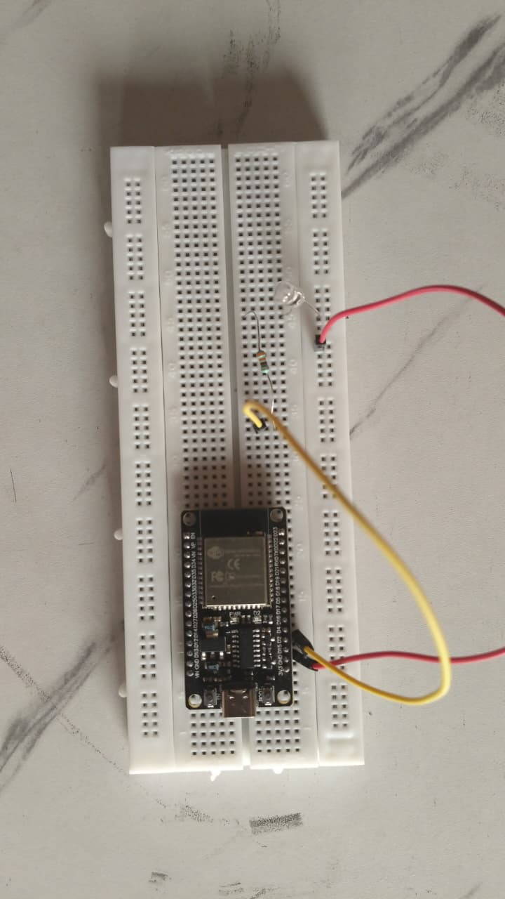

# Blinking LED

A basic ESP32 project that blinks an LED connected to GPIO2.

## Hardware

- ESP32 development board
- LED on GPIO2 (built-in LED on most ESP32 boards)



## How it works

1. Configures GPIO2 as output
2. Toggles the LED on and off with 1 second delay using FreeRTOS `vTaskDelay`

## Building

```bash
cd scripts
./esp.sh ../00-blinking-leds build
```

## Flashing

```bash
./esp.sh ../00-blinking-leds build flash
```

## Monitoring

```bash
./esp.sh ../00-blinking-leds monitor
```